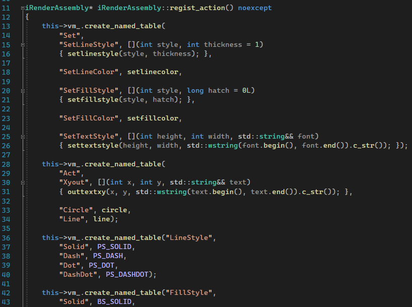
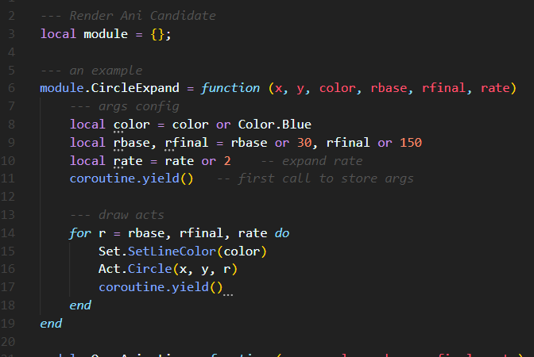
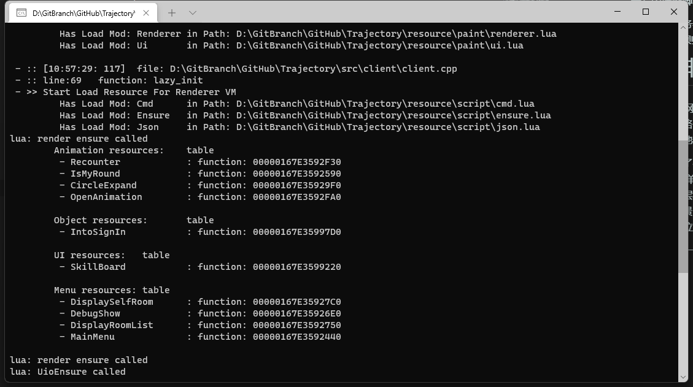
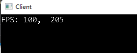
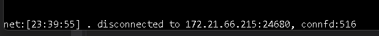
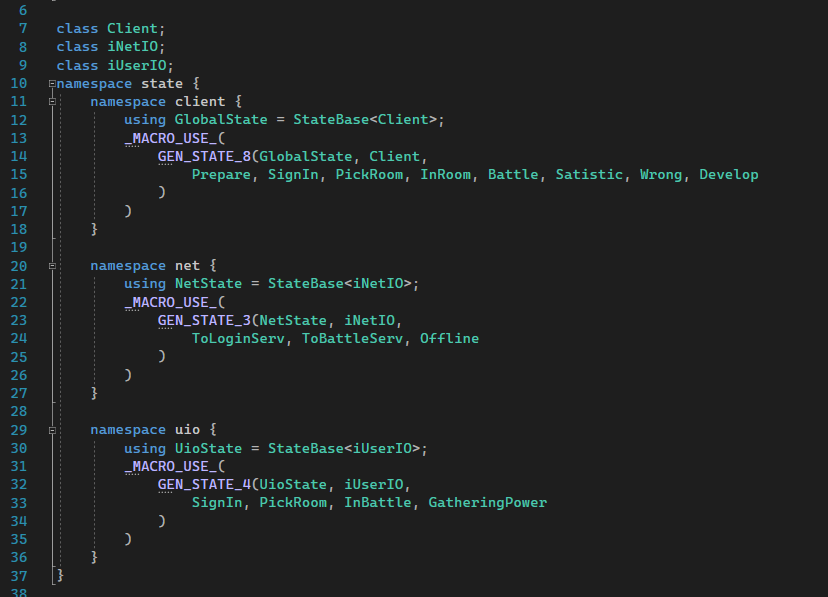

# 游戏： 这不是弹弹堂
TODO: 作为作业， 这个游戏还没写完， 目前欠缺的部分包括战斗服务器的物理引擎和脚本素材。  
前者没有完成是因为实现战斗引擎的工作量远超预期，我不确定还需要多少时间才能完成这一部分。 
后者没有完成是因为本想着先实现核心玩法， 最后完善各种素材， 最后耽误了， 导致目前的素材看起来非常简陋。

# 作业说明
该游戏是回合制多人联机对战， 通过控制发射弹道的角度和力度打击敌人造成伤害和破坏地形。 支持游戏大厅创建房间与陌生人共同游戏。

## 项目架构  
项目分为客户端client， 登陆服务器（也充当资源服务器）loginserver， 战斗服务器battleserver。 其中客户端与战斗服务器要求windows环境， 登陆服务器要求linux环境。

## 游戏流程， 标红部分为未完成的部分

客户端游戏流程是：
+ 玩家登录游戏， 可以根据配置文件设置个人信息与登陆服务器ip等， 进入游戏大厅。
+ 在游戏大厅中玩家可以选择创建自己的房间或者加入其他人的房间， 登陆服务器会自动为玩家分配战斗服务器（要求至少有一个在线的战斗服务器， 否则创建房间失败）。
+ 进入房间后， 客户端会自动加载地图/武器/其他玩家的信息， 在所有玩家的资源均加载完毕后， 房主可以开始游戏， 此时所有玩家断开与客户端连接，转而链接进入分配的战斗服务器。
+ 进入游戏， 到自己回合则可以调整角度与力度发起攻击， 由战斗服务器完成弹道/伤害/地形破坏效果的计算, 并将结果同步到所有玩家的客户端。
+  当仅剩下一名玩家存活时， 游戏结束， 进入游戏数据统计阶段， 此阶段（仅做数据显示）完毕后，客户端重新连接进入游戏大厅。
  
登陆服务器运行流程：
+ 运行后， 等待客户端或者战斗服务器链接， 前者将进入游戏大厅，后者进入可用战斗服务器队列。
+ 当有创建房间的请求时， 新建房间并分配战斗服务器。
+ 当有加入房间的请求时， 将玩家数据加入到房间中。
+ 当有资源请求时， 从磁盘中加载对应的资源文件， 并发送给客户端/战斗服务器（以此确保各个端拿到的资源文件是一致的）。
+ 当有开始游戏请求时， 将房间内所有玩家的数据发送给战斗服务器， 并断开与客户端的连接。
  

战斗服务器运行流程：
+ 在配置文件中设置登陆服务器ip地址即可， 其余资源会根据对局数据自动从登陆服务器请求。
+ 当有开始游戏的请求时， 首先新建一个对局， 请求各种资源文件， 完毕后， 向各个客户端发送回合控制数据， 正式开始游戏。
+ 当收到用户攻击的命令时， 根据客户端上传的力度与角度信息计算弹道与伤害/挖坑效果， 并将结果同步到所有客户端。

# 特性
这一部分陈述了我使用到的，觉得值得说明的特性。

+ 大量使用lua脚本与c++配合
在客户端， 通过将绘图函数注册到脚本（位于 resource/paint/ 目录下）中, 实现了所有动画效果均在lua脚本文件中完成。 能够方便的编辑动画而无需重新编译程序， 极大的增加了开发效率与动画调优时间
 
注册easyx绘图函数到lua脚本中
  
从脚本中调用绘图函数完成绘图， 图中例子为一个半径从30逐渐扩张到150的圆， 犹如涟漪扩散的动画效果， 持续120帧， 1.2s  
客户端还将一部分控制命令与设置写入脚本文件中， 当需要微调数据时均无需重新编译， 重新启动即可。    
在战斗服务器与登陆服务器中也大量使用lua脚本， 除了关键的tcp网络层通信使用socket通信完成（借用了第三方开源库 libhv ）以外， 所有逻辑均在lua脚本中完成（见 loginserver/resource 目录）（这也是为什么登陆服务器只有一个main.cpp的原因）   
此外， 游戏中所有资源文件， 包括地图/武器等关键数据， 均在脚本文件中， 这使得编辑自定义地图和自定义武器非常容易， 只需要提供关键参数即可， 特殊效果可以通过lua中定义自己需要的函数来实现（见 doc/*.md， 描述了地图与武器的脚本格式以及对应用法）

+ 服务端完成战斗数据的计算， 避免客户端使用外挂（虽然不可能有外挂）  
客户端只上传每次发射的力度和角度， 由服务器完成关键内容的计算并同步， 可以免去客户端作弊的问题。（避免了最近新发行游戏《幻塔》的悲剧）

+ 一个唯一的资源服务器， 所有的端需要资源时再请求， 而不是静态存储在本地。 
当需要更改地图/武器等数据时，只需要在登陆服务器（也即资源服务器）中调整脚本文件即可， 实现一处改动， 全服更新版本的效果。  

+ 多个战斗服务器做负载均衡， 允许玩家自行开放房间与朋友游戏， 如果需要官方提供， 则只需要在云服务器上挂一个战斗服务器即可。  

# 具体架构 
## 客户端架构
总体来说， 客户端就是层次化的状态机（见src/fsmdef.h）， 通过在不同状态中转移与进行， 控制网络io/键鼠io/渲染器三个线程的工作模式， 三个线程彼此独立， 都是  one loop per thread。   
网络io/键鼠io采用事件驱动模式， 前者事件包括（libhv封装好的）主动发包， 被动收包。 后者事件包括（easyx库封装好的）特定按键与鼠标操作等， 通过对应时间的回调函数来响应事件。  
渲染器线程使用高精度定时循环的方式来进行帧数控制。 由于绘制一帧的耗时是不确定的， 因此定时来实现固定fps的绘图。 

## 登陆服务器架构
cpp负责网络通信， 将收到的数据包传递到脚本层中， 脚本层对消息进行路由决定处理逻辑， 处理完毕后再调用cpp层的接口完成消息的回复。   
大厅中的玩家信息/就绪的战斗服务器信息等均保存在lua脚本中。 
优点是改动逻辑非常容易， 提高开发速度。 

## 战斗服务器的架构
与登陆服务器类似， 但是所有消息均在cpp层面完成响应（为了战斗的效率）。  
将收到的消息发送到对应房间， 房间根据状态与内存中的地形数据完成计算后再进行其他处理。  

# 自己觉得非常牛逼的技术点

+ 基于lua协程的sprite绘图。  
为了实现持续数帧的动画效果， 例如爆炸效果与弹道的改变， 这些sprite的magic均是lua中的协程函数。 每帧调用一遍， 当协程的状态变为：执行完毕（dead）之后再从sprite对应渲染层的队列中移除， 实现了动画效果。

+ 使用libhv做网络通信， 使用json格式描述每一个数据包， 通过json约定好的字段做消息路由， 实现了 jsonRPC， 客户端无感调用服务端的方法， 好像这个方法在本地一样。 

+ 客户端模仿了coscos-2d 引擎中渲染器做场景渲染， 将场景分为四层：动画， ui， 菜单与背景， 所有的渲染对象（sprite）都在脚本中编写， 由渲染器决定渲染层级与sprite的生命周期， 使用起来非常方便灵活。可以实现灵活多变的场景。 此外还实现了镜头跟随功能， 可以在屏幕上显示不超过边界的任意地图位置（地图大小可以编辑， 通常都超过屏幕显示大小）

+ 自己手写了一个日志库， 方便的在屏幕上打印出各种日志
 

+ 实现了开发者控制台， 显示出当前帧数与网络包的信息， 可以在配置文件中开启或关闭。  
    

+ 大量使用状态机模式与单例模式， 降低软件复杂度， 方便开发。  
在客户端中大量使用状态机（见 src/client/states.h/cpp） 将玩家在游戏中的每个阶段分成不同的状态， 不同的状态使用不同的键盘操作映射表（见 src/client/static.cpp）， 此外， 除了客户端的主状态以外， 网络线程与键鼠io线程有自己独立的状态机。 总之， 客户端的架构就是层次化的状态机来实现各阶段的功能。  
如果没有采用这种设计模式来完成这个项目， 光客户端的4000+行代码就绝对会让这个项目中途暴毙。 
 
图中是所有客户端状态的定义

+ 使用c++20标准与标准库完成开发， 大量使用c++17/20的新特性与新的标准库，  
包括：format， concept， 可变参数模板， 泛型lambda等， 极大提高了开发体验。  

# 开发过程中耽误时间的地方
+ （20%）渲染器彻底重写了一次， 部分重写了一次， 最终才确定这样的基于lua协程的多层绘图。   
好用， 但是中途失败了太多次， 成本很高。   

+ （40%）登陆服务器debug。   
虽然脚本开发速度快， 但是并不会降低debug所需要的时间。 作为需要同时与双端进行通信的部件， 调试起来实在是太麻烦了。  

+ （30%）自己编写各种素材。   
由于所有的动画效果都不是播放图片， 是每一帧绘制出来的， 导致我需要自己编写每一帧的显示逻辑， 为了达到勉强能看的效果付出了太多的时间纠结在素材的细节上， 通常是大小/颜色/持续时间等。

+ （10%）开发的最后阶段， 明明架构没有任何问题， 只剩下实现具体功能了， 相当于在已有的骨架中填肉（而不是糊屎）， 但就是写不下去了。（我不知道为什么） 

# 最终感受 
## 对于开发技术层面 
就一点： 许多我当初设计时觉得完美无缺的点， 包括网络通信与渲染层， 如今看来已漏洞百出（当然， 对于实现我的需求仍然是绰绰有余的）。 在开发过程中， 我学习了大量关于游戏引擎的知识， 包括cocos-2d， 一些unity的知识以及设计模式等并应用到其中， 导致我看现在的代码， 每一处都有更好的解决方案， 但是已没有重构的机会与余地了。   
## 对于个人学习而言 
这个项目我已经满意了， 除了他是未完成的。 如果让我回到当初设计的时候， 我敢说我一样会给出同样的设计， 已经是当时的我认知的极限了。   
在这个过程中我对自己的技术栈有了更深入的扩展， 包括c++与lua的交互， 包括网络通信的知识， 包括设计模式等。不敢说都是在已有的基础上的加深， 但新学到的东西的比例应该在十分之四以上， 学过但第一次应用的比例应该在十分之三以上。 

# 关于作业 
一幅画没有真正画完的时候， 只是画家决定不再画下去了而已。  

从完成度层面上讲， 这幅作品完成度不高， 未必能及格。 
从学习软件开发技术的角度讲， 这幅作品在我已有的经历中位列第一。 

如果老师觉得不足以通过课程考核的话， 我愿意在三天内补交一个完成度更高的《飞机大战》游戏。如果老师觉得可以通过考核的话， 那我就去学新的好玩的东西去了， 不再跟一个给初学者用的2d绘图库斗争了（其实已经变成和物理引擎的斗争了

