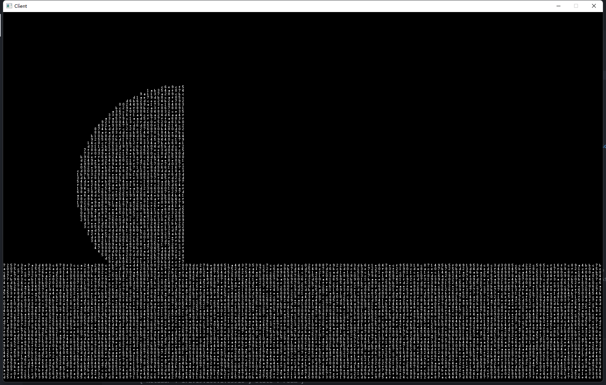

# 地形

一幅地图样例如下:
 

其中规定：
+ 屏幕所占像素大小为 1540 x 952 
+ 每一个地形单元（即图中一个字符）， 所占像素大小为 7 x 7
+ 一个屏幕上， 宽方向上有 220 列地形单元， 高方向上有  136 行地形单元 （136 = 0.618 * 220 ）

## 描述符
描述一个作战地图的脚本文件各字段含义：  

~~~ Lua 
-- 表的索引名， 需要与 Name 相同
Default = 
{
    -- 显示在游戏中的地图名字
    Name = "Default",

    -- 地图尺寸， 以单元行列数计算而非像素数
    Size =  
    {
        -- 默认地图(Default) 所占单元为 1.5 倍屏幕所能容纳的单元格数
        Colume  = 330,           -- 列数 >= 220  
        Row     = 204,           -- 行数 >= 136 
    },

    -- 最大玩家数量
    PlayerNum = 2,

    -- 出生点位置， 行列坐标而非像素坐标
    BornPoint = 
    {
        [1] = { X = 100, Y = 20 },  
        [2] = { X = 220, Y = 20 }, 
    },

    -- 十六进制地图编码 （可能是Base16 编码）
    HexStream = "02ae89f....", -- 字符串长度为 colume * row  / 4 

    -- 生成函数 function (x, y) -> bool
    -- x, y屏幕坐标系下的地形坐标, 最大值由 Size 字段决定   
    Generator = function (x, y)  
        -- 填充地图的下一半
        if y > 204 / 2 then 
            return true         -- 填充 
        else 
            return false        -- 不填充
        end 
    end, 
}
~~~ 

描述符中要求: `HexStream` 与 `Generator` 二者中至少有其一   

## 地形的加载机制 

玩家处于房间时， 客户端的状态机循环每次执行 ‘InRoom’ 状态时， 都会请求游戏数据的一部分， 而不是一次加载完， 其中的一个阶段就是请求地形数据.   

在服务端接收到请求某个地形的 request 时, 经过如下阶段
1. 查看所请求的地形的描述符中 `HexStream` 字段, 如果该字段 `不为 nil`， 则将其返回（返回格式详见 proto.lua 中 ReqDealMap\["Area"]） 
2. 如果该字段为 nil, 则根据 `Size` 字段中 `colume` / `row` 作为参数构造对应的 `BackRound` (见 BackRound.h )实例
3. 遍历 BackRound 实例中每一个地形单元, 以 行数, 列数 作为参数调用 `Generator` 函数, 完善地形图
4. 根据 BackRound 实例 为 `HexStream` 字段赋值, 并作为地形请求的返回值 

## 出生点  
必须保证出生点坐标所在不被填充 
但出生点坐标不一定要填充区域, 战斗服务器的物理引擎会自动让其下落到存在地形的位置

## 结论  
传输以及加载时使用 HexStream , 但编辑自定义地图时, 只需要提供生成函数即可 